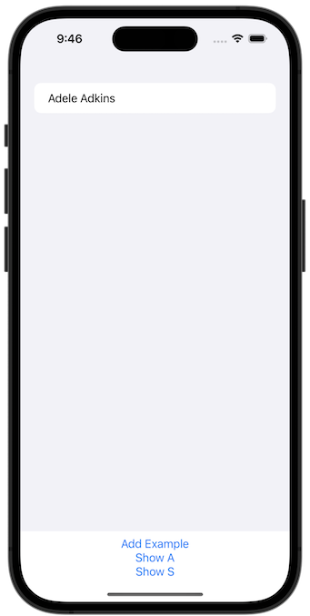
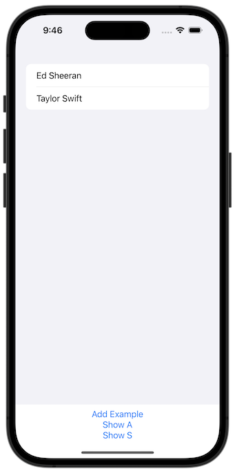

# Project 12 - Core Data

https://www.hackingwithswift.com/100/swiftui/57

Includes solutions to the [challenges](https://www.hackingwithswift.com/books/ios-swiftui/core-data-wrap-up).

## Topics

Core Data

## Challenges

From [Hacking with Swift](https://www.hackingwithswift.com/books/ios-swiftui/core-data-wrap-up):

> 1.  Make it accept a string parameter that controls which predicate is applied. You can use Swift’s string interpolation to place this in the predicate.
> 2.  Modify the predicate string parameter to be an enum such as .beginsWith, then make that enum get resolved to a string inside the initializer.
> 3.  Make FilteredList accept an array of SortDescriptor objects to get used in its fetch request.

## Screenshots

